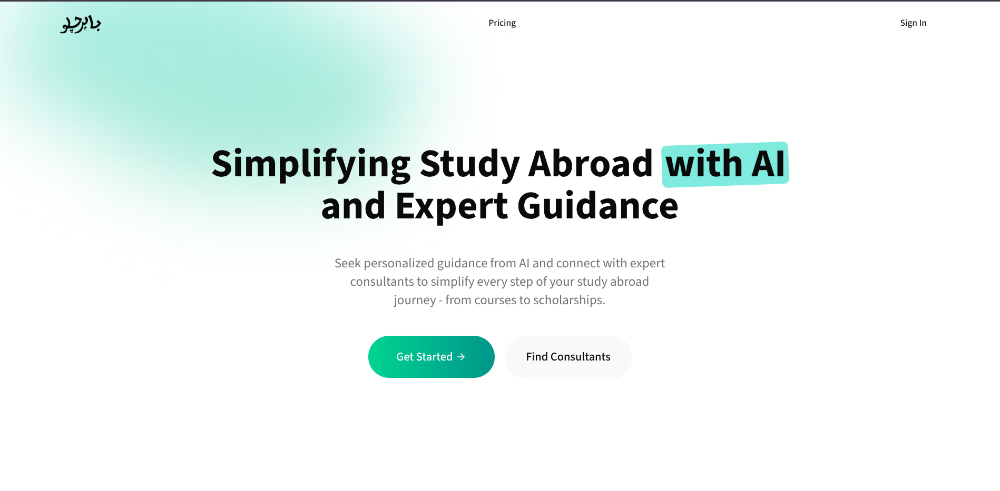

# Bahir Chalo

- AI powered Application that helps students find study abroad opportunities with AI (Gemini) generated personalized roadmaps
- Students can connect with consultants by booking appointments
- Admin verifies consultants; students can only view verified ones
- Consultants manage availability, appointments, and appointments status updates

---

---

# 🚀 Modules Completed

- Auth: Sign-in, Sign-up, Verify-OTP, Reset-Password using JWT Authentication
- Admin: Verify Consultants, View all Consultants
- Student: View only verified consultants, Generate AI-based personalized roadmaps with Gemini API, View previously generated roadmaps, Cancel Appointments
- Consultant: Set availability (applies for all days), View booked appointments, Cancel and Complete Appointments

---

# 🔮 Modules To Be Completed

- Payments (consultation or subscription)
- Video Calls (1:1 meeting between student and consultant)
- Notifications (emails / in-app)

---

# 🛠 Tech Stack

- Next.js
- Tailwind CSS
- React Query
- Axios
- ShadCN/UI
- Motion

---

# ⚙️ Setup

- Clone the repository  
  `git clone https://github.com/hammadProjects/bahir-chalo.git`
- Navigate to the project folder  
  `cd bahir-chalo`
- Install dependencies  
  `npm install`
- Run the development server  
  `npm run dev`
- The app will start on http://localhost:3000

---
